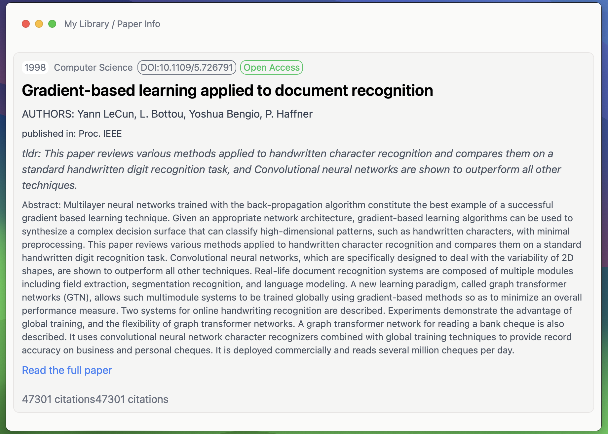

# derive

derive is app that helps you manage research papers, articles, and other documents. It is built with [Tauri](https://tauri.studio/), [React](https://react.dev/), and [Tailwind CSS](https://tailwindcss.com/).




## Installation

```bash
bun install
```

## Usage

### Web App
```bash
bun run dev
```

### Desktop App
```bash
bun run tauri dev
```

### Recommended IDE Setup

- [VS Code](https://code.visualstudio.com/) + [Tauri](https://marketplace.visualstudio.com/items?itemName=tauri-apps.tauri-vscode) + [rust-analyzer](https://marketplace.visualstudio.com/items?itemName=rust-lang.rust-analyzer)
